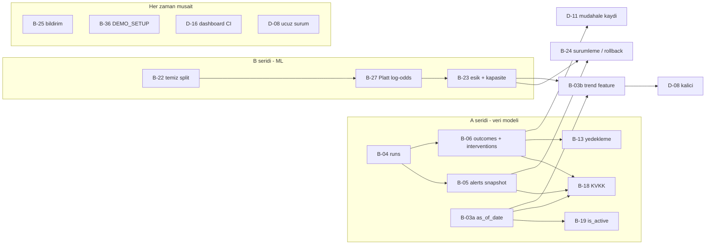

# Issue sirasi ve bagimliliklar

Bu dosya tek bir soruyu cevaplar: **"simdi hangi issue'ya baslayabilirim?"**

Iki kisi paralel calisiyoruz. Bir issue'ya baslamadan once buradaki uc seyi
kontrol et:

1. **Engelleyeni kapandi mi?** (bolum 3, `Engelleyen` kolonu)
2. **Senin seridinde mi?** (bolum 2 — serit disina cikma, merge cakismasi cikar)
3. **Sicak dosyaya dokunuyor mu?** (bolum 5)

Ucu de tamamsa branch ac. Biri tamam degilse bolum 6'daki "her zaman musait"
listesinden bir is al.

---

## 1. Temel kurallar

| | kural |
|---|---|
| **Branch** | `b-04-runs-tablosu` gibi: issue numarasi + kisa slug, kucuk harf, Turkce karakter yok |
| **PR** | Bir issue = bir branch = bir PR. PR aciklamasinin ilk satirinda `Closes #<numara>` |
| **Base** | Her branch `master`'dan acilir. Baska bir issue'nun branch'inden **acilmaz** — o issue merge olmadan basla demek zaten yasak |
| **Rebase** | Kendi branch'inde calisirken `master`'a bir sey merge olduysa `git fetch && git rebase origin/master`. Merge commit'i degil rebase |
| **Uretilen dosyalar** | `saved_models/*`, `data/updated_data.csv`, `data/daily_alerts.csv` uretilen dosyalar; git bunlari **birlestiremez**. Sadece B seridi (ML) bunlari commit eder. A seridi asla commit etmez — `git checkout -- saved_models data/updated_data.csv` ile geri al |
| **Test** | PR acmadan once `pytest -q` yesil olmali ve testler **skip olmamali**. Kac test gectiyse PR aciklamasina yaz |
| **Migration** | Bolum 7'deki numara rezervasyonuna uy. Ikimiz de `003_` yazarsak birimiz bastan yazar |

---

## 2. Iki serit

Issue'lar iki zincir halinde. Zincirler birbirine neredeyse hic dokunmuyor;
**zincir icinde ise sira zorunlu.** Kimse kendi seridinden cikmasin.

### A seridi — veri modeli / DB
`db/schema.sql`, `db/migrations/`, `src/data/loader.py`, `scripts/load_*.py`

```
B-04  ->  B-05  ->  B-03a  ->  B-19  ->  B-06  ->  B-18
```

### B seridi — model / ML
`pipeline/training_pipeline.py`, `src/model/*`, `src/data/preprocess.py`

```
B-22  ->  B-27  ->  B-23  ->  B-24
```

**Onerilen dagilim:** B seridi Riza'da (karar gerektiren isler: esik, kapasite,
kalibrasyon — bunlar teknik degil urun kararlari), A seridi arkadasinda (kabul
kriterleri net, olculebilir, tek basina bitirilebilir).

**Iki senkron noktasi var** — bunlarda birbirinizi beklemek zorundasiniz:

- **B-24**, hem B-05 (A seridi) hem B-23 (B seridi) merge olmadan baslamaz.
  `model_version` alarm satirlarina yaziliyor; o kolon B-05'te aciliyor, o
  degerin ne olacagi B-23'te kesinlesiyor.
- **B-03b** (trend feature uretimi), B seridinin tamami merge olmadan baslamaz.
  Ikisi de `src/data/features.py` + `config.py` yaziyor.

---

## 3. Bagimlilik tablosu

`Engelleyen` bos ise bugun baslanabilir.

### Backend

| Issue | Engelleyen | Kimi engelliyor | Neden |
|---|---|---|---|
| **B-04** `runs` tablosu | — | B-05, B-06 | `alerts.run_id` ve `interventions.run_id` foreign key'leri bu tabloya bakiyor. Tablo yoksa ikisi de yazilamaz |
| **B-05** alerts snapshot + model_version + threshold | B-04 | B-24 | `alerts.run_id` FK B-04'e; B-24'un yazdigi `model_version` bu issue'da acilan kolon |
| **B-03a** `as_of_date` (sadece DB) | — (B-04 ile ayni dosyalar) | B-19, B-03b, template blogu | `daily_students` primary key `(entity_id, as_of_date)` oluyor. B-19 "bugunun dosyasinda olmayan" tanimini bu kolondan aliyor |
| **B-03b** trend feature uretimi (`_delta_7d`, `_delta_28d`) | B-03a **+ B seridinin tamami** | D-08 kalici cozumu | Trend, ayni `as_of_date` icin birden fazla satir olmasini gerektiriyor. `features.py` + `config.py` yazdigi icin B seridiyle cakisir |
| **B-19** budama / `is_active` | B-03a | — | "Aktif ogrenci" tanimi `as_of_date`'e dayaniyor; B-03a olmadan `is_active` kolonu ikinci bir dogruluk kaynagi olur |
| **B-06** outcomes + interventions tablolari | B-04 | D-11, pilot olcumu | `interventions.run_id` FK B-04'e |
| **B-18** KVKK silme / anonimlestirme | B-03a, B-04, B-05, B-06 | — | Kisisel veri tutan **tum** tablolari bilmesi gerekiyor. Once yazilirsa her yeni tablo icin tekrar yazilir |
| **B-13** yedekleme | B-04, B-05, B-06 (yumusak) | — | Teknik olarak bugun yazilabilir ama yedeklenecek sema degisiyor. Sema oturduktan sonra bir kez yaz, bir kez test et |
| **B-22** temiz split'ler | B-21 (kapandi) | B-27, B-23 | Kalibrasyon ayri bir dilime tasinmadan kalibrasyonun nasil fit edildigini (B-27) degistirmek olcum yapmaz |
| **B-27** Platt log-odds uzerinde | B-22 | B-23 | Esik kalibre olasiliklara gore seciliyor; kalibrasyon degisince esik de degisir |
| **B-23** esik ile mentor kapasitesi | B-22, B-27 | B-24 | Esigi kesinlestirmeden model surumleme yapmak, ilk gun rollback gerektiren bir surum uretir |
| **B-24** surumleme / rollback / drift | B-23 **+ B-05** | — | Senkron noktasi. Bkz. bolum 2 |
| **B-25** bildirim dayanikliligi | — | — | Bagimsiz. `channels.py` / `message.py` disina cikmiyor |
| **B-36** `docs/DEMO_SETUP.md` | — | — | Bagimsiz, sadece dokuman. Yeni gelen biri icin en degerli ilk is |
| **B-37** `RnD/` ayiklamasi | — | — | Bagimsiz **ama cok dosya tasiyor.** Iki serit de bos oldugunda tek basina yapilmali, yoksa herkesin branch'i cakisir |

### Dashboard (ayri repo — cakisma yok, sira var)

| Issue | Engelleyen | Neden |
|---|---|---|
| **D-08** widget'lari gizle (ucuz surum) | — | Veri kaynagi olmayan kolonlari gizlemek backend'e bagli degil. Toplanti oncesi yapilmali |
| **D-08** kalici surum (gercek gecmis) | B-03b + alarm gecmisi endpoint'i | Gecmis veri olmadan gosterilecek bir sey yok |
| **D-11** `iletisime gecildi` kalici olsun | B-06 (kalici), — (gecici) | Gecici `localStorage` surumu bugun yapilabilir; sunucuya yazan surum `POST /interventions` bekliyor |
| **D-16** dashboard CI | — | Bagimsiz, backend'e hic dokunmuyor |

---

## 4. Grafik



---

## 5. Sicak dosyalar

Bir dosyada ikimiz de calisiyorsak PR'lar sirayla merge olmali. Asagidaki
dosyalar iki seridin de dokundugu yerler:

| dosya | kim dokunuyor | kural |
|---|---|---|
| `config.py` | ikisi de | Yeni ayar **dosyanin sonundaki kendi bolumune** eklenir, mevcut bloklarin arasina girilmez. Boylece git cakismayi cozer |
| `README.md` | ikisi de | Sadece kendi bolumunu duzenle. Metrik tablosu **yalniz B seridi** |
| `db/schema.sql` | sadece A | B seridi bu dosyaya hic dokunmaz |
| `src/data/features.py` | B-03b (A) ve B-22 (B) | Ayni anda **asla**. Bu yuzden B-03b, B seridi bittikten sonra |
| `saved_models/*`, `data/updated_data.csv` | sadece B | Uretilen dosya, git birlestiremez. A seridi commit ederse B'nin modelini ezer |
| `pipeline/daily_pipeline.py` | ikisi de | Kucuk dosya, cakisirsa elle cozulur. PR'i kisa tut |

---

## 6. Sira bos kaldiginda

Engelleyeni kapanmamis bir issue'yu beklemek yerine su listeden al. Hicbiri
kimseyi engellemiyor, hicbiri sicak dosyaya dokunmuyor:

1. **B-36** `docs/DEMO_SETUP.md` — yarim gun, toplanti oncesi lazim
2. **D-08 ucuz surum** — veri kaynagi olmayan widget'lari gizle
3. **D-16** dashboard CI
4. **B-25** bildirim dayanikliligi (retry, `Retry-After`)
5. **D-11 gecici surum** — `localStorage`, try/catch'li
6. **B-37** `RnD/` ayiklamasi — **sadece iki serit de bos oldugunda**

---

## 7. Migration numarasi rezervasyonu

Mevcut: `000_baseline`, `001_churn_probability_to_double`,
`002_alerts_unique_run_at_student_id`.

Sonraki numaralar **simdiden** ayrildi. Ikimiz de `003_` yazmayalim:

| numara | issue |
|---|---|
| `003_` | B-04 `runs` tablosu |
| `004_` | B-05 `alerts` snapshot kolonlari |
| `005_` | B-03a `daily_students` `as_of_date` |
| `006_` | B-19 `is_active` |
| `007_` | B-06 `outcomes` + `interventions` |
| `008_` | B-18 `erasure_log` + `ON DELETE` politikalari |

Numarasi ayrilmis bir issue'yu yapmayacaksan, atlanmis numara bir sorun degil —
`init_db.py` sirayla uygular, bosluga takilmaz. Ama **ayni numarayi iki kisi
kullanirsa** biri bastan yazar.

---

## 8. Donmus blok — baslanmayacak

Bu issue'lar kapali degil, **ertelendi.** Ilk musteri olmadan yapilirsa yanlis
soyutlama uretirler:

- **B-29 ... B-35** (template / `clients/` iskeleti, `ClientProfile`, entity
  soyutlamasi, `GET /schema`, mesaj sozlugu, scaffolder, ikinci dikey)
- **D-12, D-13** (etiketler `GET /schema`'dan, beyaz etiket)

Ayrica **B-03a template blogundan once kapanmali** — sonra kapanirsa her musteri
profilinde tekrar edilir.

Karara bagli olup pilotta netlesecekler: **B-13** (yedek nereye), **B-23**
(mentor kapasitesi kac kisi), **B-18** (saklama suresi). Ucunun de
**mekanizmasi** simdi yazilir, geriye tek bir config degeri kalir.

---

## 9. Kapanmis issue'lar

Referans icin. Bunlara tekrar baslanmaz.

**Backend:** B-01, B-02, B-07, B-08, B-09, B-10, B-11, B-12, B-14, B-15, B-16,
B-17, B-20, B-21, B-26, B-28

**Dashboard:** D-01, D-02, D-03, D-04, D-05, D-06, D-07, D-09, D-10, D-14, D-15
